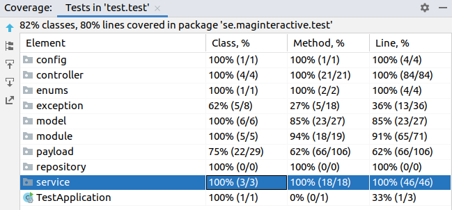

#### introduction

* How to run
* Rest description
* Project Endpoints
* Successful Endpoint calls
* Unsuccessful Endpoint calls
* Transaction structure (DEPOSIT, WITHDRAW, PURCHASE)
* Test Coverage
* Project Shortcomings

_________________________

### Run

With this application is started with **./gradlew bootRun**

### Rest Standards

I take care of Richardson Maturity Model of Level-3 HyperMedia Controls. 

###### POST 201 (CREATED)

###### PUT, 200 (OK), 201(CREATED),  or 204 (NO_CONTEXT)

###### DELETE 200 (OK), or 204 (NO_CONTEXT), If in the que 202 (Accepted)

* Return Http codes.
    * 200 OK
    * 201 CREATED
    * 400 BAD_REQUEST  
    * 404 NOT_FOUND
    * 406 NOT_ACCEPTABLE
    * 418 I_AM_A_TEAPOT    :)  
    * 500 INTERNAL_SERVER_ERROR (Wrap with my exception)

* Return created or updated URI in response like below     

    *  Example when want to create a new account.
  
        
            localhost:8080/account/create

            Response Body: {
                                "id": 3,
                                "balance": 0
                            }

            Header : Location : http://localhost:8080/account/3

* Controllers have an interface for giving versions. it is also more accurate to give a version to the first implementations.
  
        @RestController
        public interface StoreController {

        @Controller
        @RequiredArgsConstructor
        public class StoreControllerImpl implements StoreController {

        @Controller
        @RequiredArgsConstructor
        @RequestMapping("/api/v2")
        public class StoreControllerImplV2 implements StoreController {

* I wrote the endpoints according to pdf document. Also, it could be like the below. So the code could be more clean.

| Request Type  | Request Mapping | Goal  |
| ------------- | ------------- | ------------- |
| @GET  | /accounts/  | findAll |
| @GET  | /accounts/{id}  | findById |
| @POST  | /accounts/  | create |
| @PUT  | /accounts/{id}  | update |
| @DELETE | /accounts/{id}  | delete |
| @POST  | /accounts/{id}/deposit | createByAccountId | 
| @POST  | /accounts/{id}/withdraw | createByAccountId|
| @POST  | /accounts/{id}/listTransactions | findAllByAccountId |
| @GET  | /products/  | findAll |
| @GET  | /products/{id}  | findById |
| @POST  | /products/create | create |
| @PUT  | /products/update | update |
| @DELETE | /products/delete  | delete |
| @POST  | /store/buy |  |

* '/store/list' and '/product/list' are the same endpoint.  If necessary, we can create an API by applying a facade pattern.

* I tried to gather **Error Handling**. It can be still improved.

  

Can find some examples in **Unsuccessful Endpoint calls** part 

* Allow  sorting, and pagination

      localhost:8080/api/v1/product/list
  
      localhost:8080/api/v1/product/list?pageSize=3&pageNo=1

      localhost:8080/api/v1/product/list?pageSize=3&pageNo=0&sortBy=name

______

# Project Endpoints
| Request Type  | Request Mapping |
| ------------- | ------------- |
| @POST  | /account/create  |
| @POST  | /account/deposit  |
| @POST  | /account/withdraw  |
| @POST  | /account/listTransactions  |
| @POST  | /product/create  |
| @GET  | /product/list  |
| @POST  | /product/delete  |
| @POST  | /product/update  |
| @GET  | /store/list |
| @GET  | /store/buy |

### Successful Endpoint calls

Also has **POSTMAN** script in the project folder.

all endpoints have **/api/v1** prefix

##### @POST /account/create

    Body: None
    Response:
    {
        "id": 3,
        "balance": 0
    }

##### @POST /account/deposit

    Body:
    {
        "accountId": 1,
        "amount": 300
    }
    Response:
    {
        "id": 1,
        "balance": 300.00
    }

##### @POST /account/withdraw

    Body:
    {
        "accountId": 1,
        "amount": 100
    }
    Response:
    {
        "id": 1,
        "balance": 600.00
    }

##### @POST /account/listTransactions

    Body:
    {
        "accountId": 1
    }
    Response:
    {
        "transactions": [
            {
                "id": 1,
                "accountId": 1,
                "amount": 300.00,
                "date": "2021-01-26T23:46:17.937602+02:00",
                "type": "DEPOSIT"
            }
            {
                "id": 2,
                "accountId": 1,
                "amount": 100.00,
                "date": "2021-01-26T23:46:23.45435+02:00",
                "type": "WITHDRAW"
            }
        ]
    }

##### @POST /product/create

    Body:
    {
        "product": {
        "name": "Rubber Duck",
        "price": 250,
        "count": 200
        }
    }
    Response:
    {
        "id": 1,
        "name": "Rubber Duck",
        "price": 250,
        "count": 200
    }

##### @POST /product/list
###### ProductList allow pagination and sort
###### Default Page request [number: 0, size 1000, sort: id: ASC]

    Body: NONE
    Response:
    {
        "products": [
            {
                "id": 1,
                "name": "Rubber Duck",
                "price": 250.00,
                "count": 200
            }
        ]
    }

###### /product/list?pageSize=10
###### /product/list?pageSize=3&pageNo=0
###### /product/list?pageSize=3&pageNo=0&sortBy=name  (below response belong this url)

    Body: NONE
    Response:
    {
    "products": [
        {
            "id": 3,
            "name": "Apple",
            "price": 250.00,
            "count": 200
        },
        {
            "id": 1,
            "name": "Rubber Duck",
            "price": 250.00,
            "count": 200
        },
        {
            "id": 2,
            "name": "Test1",
            "price": 250.00,
            "count": 200
        }
    ]
}

##### @POST /product/update

    Body:
    {
        "product": {
        "id": 1,
        "name": "Yellow Rubber Duck",
        "price": 250,
        "count": 200
        }
    }
    Response:
    {
        "id": 1,
        "name": "Yellow Rubber Duck",
        "price": 250,
        "count": 200
    }

##### @POST /product/delete

    Body:
    {
        "product": {
            "id": 1
        }
    }
    Response:
    {
        "id": 1,
        "name": "Yellow Rubber Duck",
        "price": 250,
        "count": 200
    }

##### @POST /store/list

    Body: NONE
    Response:
    {
        "products": [
            {
                "id": 1,
                "name": "Rubber Duck",
                "price": 250.00,
                "count": 200
            }
        ]
    }

##### @POST /store/buy

    Body:
    {
        "accountId": 1,
        "productId": 1
    }
    Response:
    {
        "transactions": {
            "id": 4,
            "accountId": 1,
            "amount": 250.00,
            "date": "2021-01-27T01:56:30.466583+02:00",
            "type": "PURCHASE",
            "productId": 1
        }
    }

### Unsuccessful Endpoint calls

##### @POST /account/deposit

   **When try to send zero or less amount**

    Body:
    {
      "accountId": 1,
      "amount": 0
    }
    Response:
    {
        "timestamp": "2021-01-26T23:58:58.884+00:00",
        "status": 406,
        "error": "Not Acceptable",
        "message": "Amount can not be zero or less!",
        "path": "/account/deposit"
    }

  **When try to send not exist account**

    Body:
    {
      "accountId": 2,
      "amount": 200
    }
    Response:
    {
        "timestamp": "2021-01-27T00:00:40.990+00:00",
        "status": 404,
        "error": "Not Found",
        "message": "Account not found!",
        "path": "/account/deposit"
    }

##### @POST /account/deposit
  **When you try to withdraw more money than the account has**

    Body:
    {
      "accountId": 1,
      "amount": 500
    }
    Response:
    {
        "timestamp": "2021-01-27T00:03:09.459+00:00",
        "status": 406,
        "error": "Not Acceptable",
        "message": "Account balance is 250.00, request amount is 500",
        "path": "/account/withdraw"
    }

##### @POST /store/buy
  **When the price of the product tried to buy is more than the one on the account**

    Body:
    {
      "accountId": 1,
      "productId": 1
    }
    Response:
    {
        "timestamp": "2021-01-27T00:03:09.459+00:00",
        "status": 406,
        "error": "Not Acceptable",
        "message": "Account balance is 0.00, request amount is 250.00",
        "path": "/store/buy"
    }

  **When product stock is not enough to buy**

    Body:
    {
      "accountId": 1,
      "amount": 500
    }
    Response:
    {
        "timestamp": "2021-01-27T00:03:09.459+00:00",
        "status": 406,
        "error": "Not Acceptable",
        "message": "Product stock is not enough!",
        "path": "/store/buy"
    }

__________

## Transaction structure (DEPOSIT, WITHDRAW, PURCHASE) 

##### This structure apply Factory Design Pattern and Open Closed Solid Principle.

should be open for extension, but closed for modification.

Encapsulated the transaction module

## Test Coverage

I wrote positive and negative tests. The project has 51 test.

Also, I should complete exceptions class tests.

## Project Shortcomings
 
 * I added a small log mechanism. It is not enough the logback file can be added. So We can log all requests and responses.
 * The Spring security can be added.  I didn't add to avoid the complexity.
 * I could use a global custom error handler.With ControllerAdvice
   https://codeburst.io/spring-boot-rest-microservices-best-practices-2a6e50797115
	https://www.toptal.com/java/spring-boot-rest-api-error-handling
 *Logging.I could add logback or like that configuration. 
   And I can return the trace id to the consumer. 
   So I can find errors easily with kibana, or like those tools.
 *Security  (JWT and spring security apply)
 *Cache data to improve performance
   https://www.baeldung.com/spring-cache-tutorial
   https://www.youtube.com/watch?v=ccfQ1j4suN0
 *I would use database migration tools. Like a Liquibase or Flyway. Also, It can be beneficial for backup scenarios.
 *Can use API documentation tools like a swagger or springdoc-openapi.
 *We can containerize it.
 *Monitoring and availability  spring-boot-actuator
 * ... 

